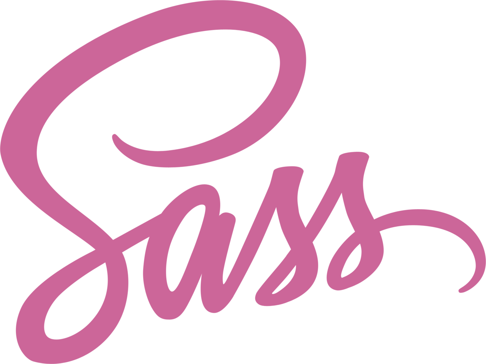

# Fylo Dark Theme Landing Page

  

## ☕ General Overview

Challenge from [Frontend Mentor](https://www.frontendmentor.io/challenges/fylo-dark-theme-landing-page-5ca5f2d21e82137ec91a50fd). Coded by [me](https://www.frontendmentor.io/profile/vanzasetia), using 📱Android Phone! The reason for that is because I don't have any computer or laptop ☺️.

On this challenge, I try to implement SEO things like using `robots.txt` and `sitemap.xml`. I also used `aria-label` for screen reader user. I'm not an expert on both SEO and accessibility so if you want to share your knowledge to me about those topics, you contact through [Gmail]() or if you're from Frontend Mentor you can chat with me on [community feedback section on Frontend Mentor]()

Here is the [live review]() and the [solution link]().

## ⚙️ Tools

I have several tools that I use to code:

- 💻 [Termux](https://f-droid.org/packages/com.termux/) as my terminal. I use this for git and also npm related stuffs. But keep in mind that you can't run `npm i -D <package>` since it's not allowed, unless you have root access on your phone.
- 📝 [Acode](https://play.google.com/store/apps/details?id=com.foxdebug.acodefree) as my code editor. It has a nice highlighting syntax for HTML, CSS, Sass(scss syntax), and JavaScript.
- 🛠️ [Eruda](https://github.com/liriliri/eruda) as my dev tool. It's not a change for dev tool on desktop. But it has some awesome features, such as inspect an element, JavaScript console, and much more.

## Languages

